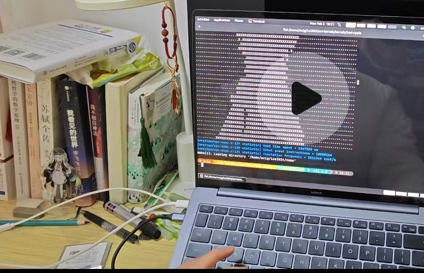
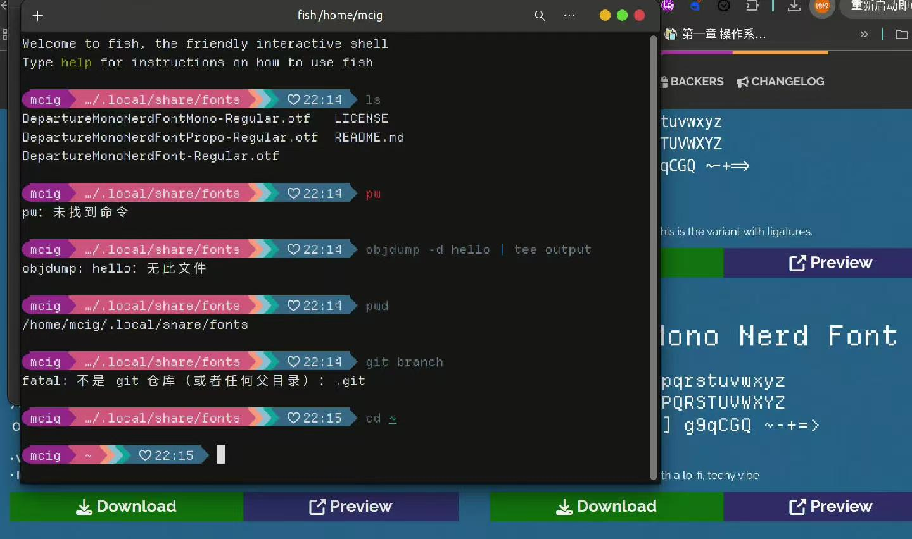
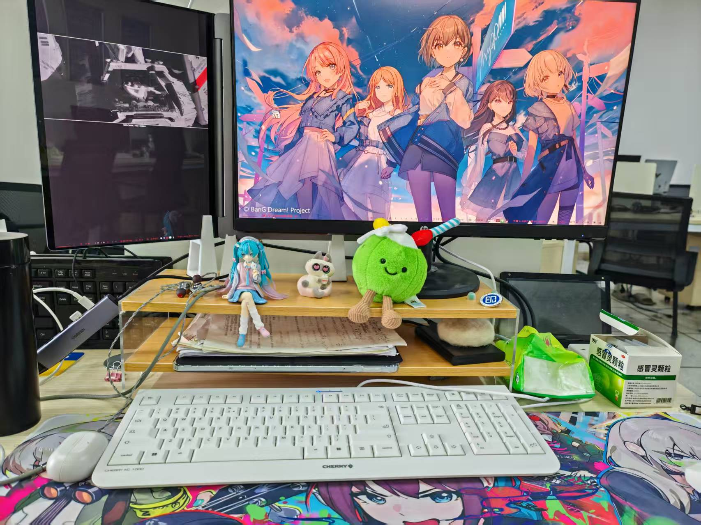
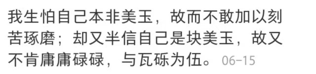

# 2025总结

1月期末周，准备时间够长，期末考的还行，有10%，但我的大一上也就这样了。就做了61b，61c，61b也没自己写多少代码，代码能力一直很弱，拄着ai的拐杖走的，只会看代码。

2月在做南大pa，差不多第一次接触比较大的项目。当时完全不知道该怎么看，流程搞不懂，代码只能看教程里的提示，慢慢摸索的写。后面越看越看不懂，然后只能停下来整理下框架的内容，学会看main函数，打断点，printf去debug，看流程。以及以后了解到大项目先去了解业务流程，再去按模块的看代码，看懂流程先，不用管细节。这样我觉得我稍微有一些阅读大项目的经历了，下面是当时做pa，以及当时在ubuntu搞的终端美化。（我以后还会搞无数次美化。）{width=600}
{width=600}

三月回学校，被忽悠说每个人必须参加大创，想着不如找个好老师干点活。浪费一个月学slam，以及写申报书，发现我是真讨厌干这种文书工作，以后再也不去。这个月就这么没了，然后也算幸好吧，大创申报没过。不然后面的时间又要被浪费。不过这个月接触了一点论文阅读，接触了一点相关工具，仅此而已。

四月到六月。我的春天和夏天又被偷走了。谈恋爱，然后几个月之后分手。我不想对这段关系做什么评价，就这样吧。我只知道人是会一点点成长的，我一直坚信这一点。 谈恋爱，所以没学什么，看了一点cs188，学了点ai基础而已。学校办了排球阳光杯，排球就是我的生命。打排球让我认识了很多人，排球就是一直向上看的运动。

七月到八月。暑假。看计网，以及jyyos。印象里就这些。还有学车。jyyos现在还没看完，后面又有别的事了，没空看课。以前总是不在obsidian里写日记，导致我不记得做了什么，这个习惯还是得坚持。

九月回来学校，继续看了一段时间jyyos，后面改变我生活的时间点来了。我们学校InnOSeed(原苹果实验室)办了黑客松，那我自然是去尝试一下。虽然过程有不顺利的地方，时间也很短，没做出什么。但是后面的面试我感觉准备的还算可以。我成功进实验室了。我第一次有了自己的工位。照片里的是最近一段时间把笔记本立起来了。（是的我从ubuntu折腾到arch再折腾回ubuntu，但是我还是hyprland的狗）{width=600}

十月到十二月，和学长聊天，发现自己可能比起传统互联网，做具身也许更合适。于是就开始学具身相关的内容，从robotics到rl，寒假打算继续看看。进实验室真的让我的世界线发生变动，以前总是孤自一人学习，后面终于线下能有人和我聊技术了。聊linux发行版，聊聊各种东西。有人一起聚餐，有人一起出去玩。找到家了。不过实验室没人做具身，学习还是得一个人学。然后在cc的影响下进了dubbogo社区，虽然没在dubbogo干活，但是在雨哥手下的kiwi干活，认识一些人也挺好的。

明年计划的话，下学期找我们学校具身相关的老师，进去干点活。我需要动手做东西，而不是看各种理论各种教程。看看大二暑假能不能去企业实习。希望吧。路还很长。
一
些感悟，原本想在博客上另外开一篇文章的，就放在年度总结里边吧。
以前总是孤高自傲，觉得自己就是那少数的被选中的人。其实实际上每次在人生的关键节点，抱着被选中的幻想，抱着对自己实力幻想，但是实际上我的能力就那样了，上不去下不来。与其这样抱着不切实际的幻想，不如降低需求老老实实做事。之前高三做阅读看到下面山月记的一段话。{width=600}
我还不至于此，我知道自己是什么垃圾，知道自己的实力就在什么地步，所以希望自己不会变成老虎在山中吟啸吧。

新的一年继续加油
