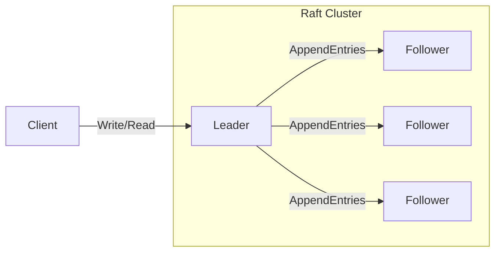
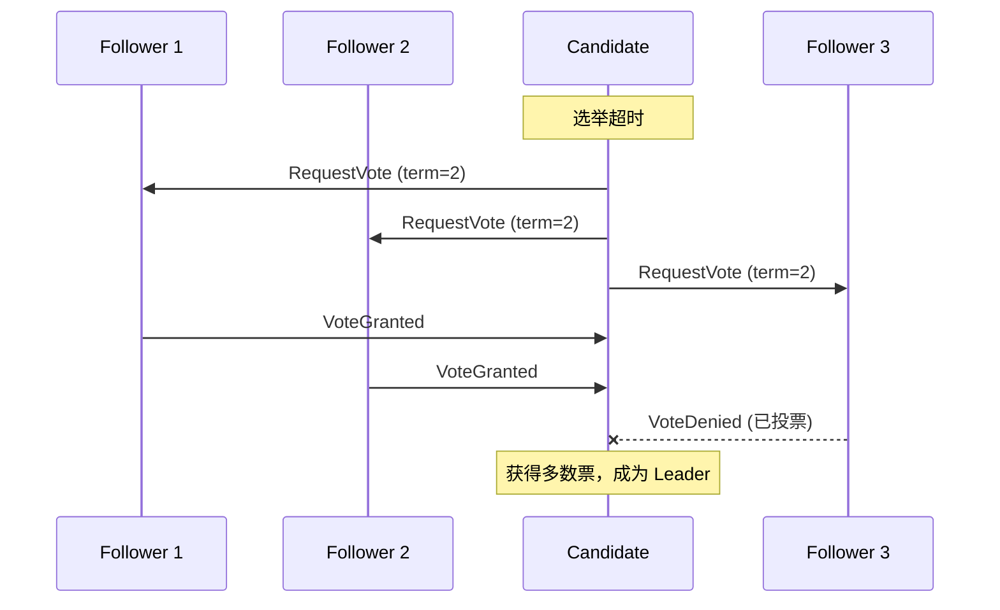
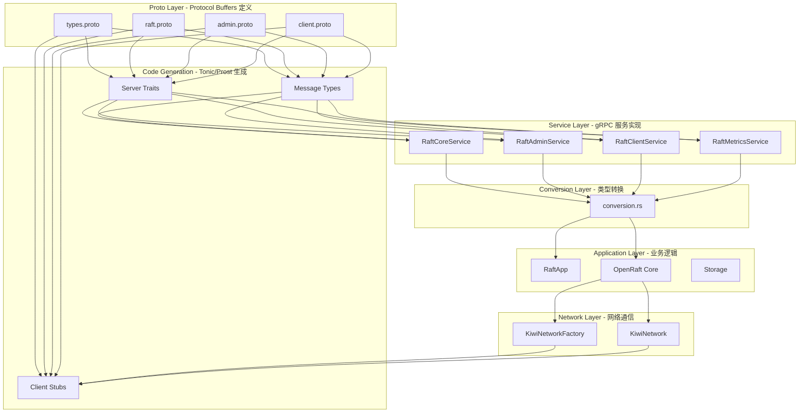
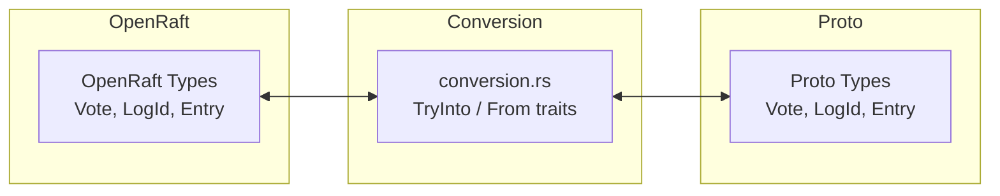
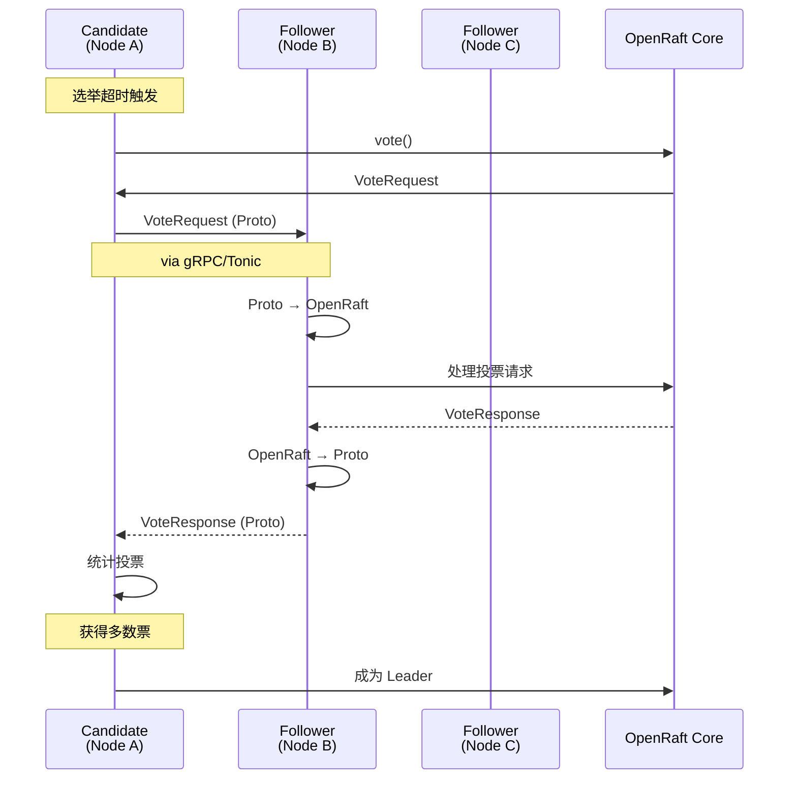
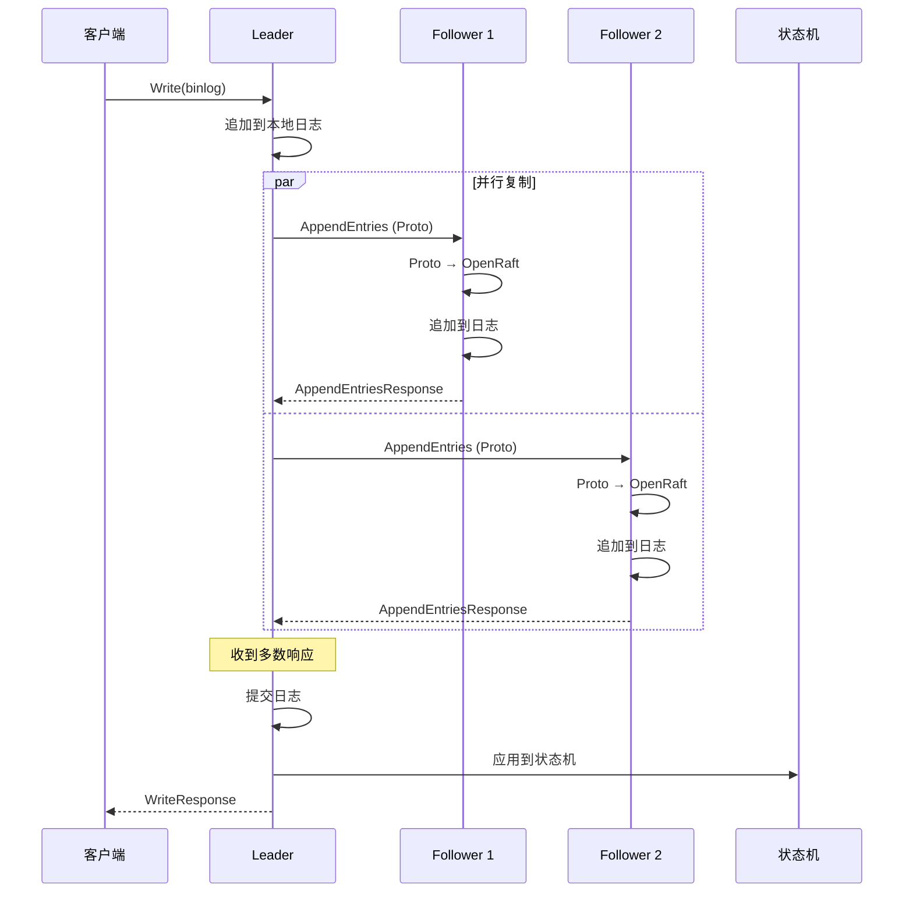
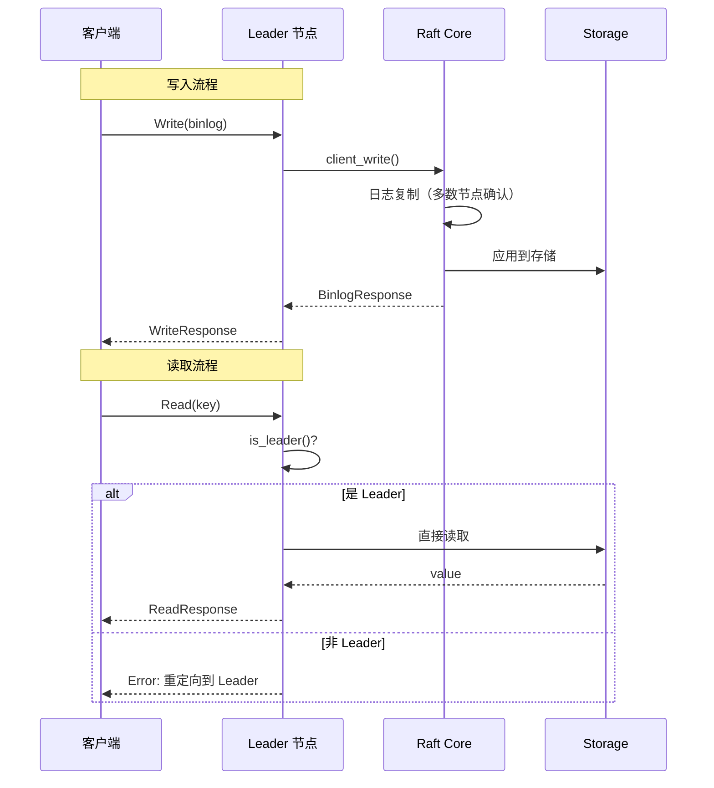
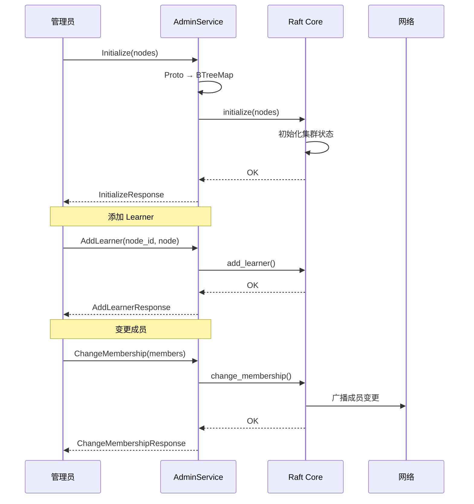

# # Tonic 实现 Raft 层 RPC 通信技术文档

  

---

  
## 目录


- [1. 概述]()
- [2. Raft 协议简介]()
- [3. 系统架构]()
- [4. Protocol Buffers 定义]()
- [5. 类型转换层]()
- [6. RPC 通信实现]()
- [7. 完整通信流程]()
- [8. 总结与展望]()

  

---

## 1. 概述

### 1.1 项目背景

Kiwi 是一个基于 Raft 共识算法的分布式存储系统。为了实现节点间的高效通信，我们选择了 **gRPC** 作为 RPC 框架，并使用 **Tonic**（Rust 生态中的 gRPC 实现）来构建 Raft 层的通信能力。

### 1.2 技术栈

  

| 组件      | 技术选型                                                    | 用途            |
| ------- | ------------------------------------------------------- | ------------- |
| Raft 实现 | [OpenRaft](https://github.com/datafuselabs/openraft-rs) | 生产级 Raft 共识库  |
| RPC 框架  | [Tonic](https://github.com/hyperium/tonic)              | Rust gRPC 实现  |
| 序列化     | Protocol Buffers + Prost                                | 高效的二进制序列化     |
| 数据序列化   | Bincode                                                 | Rust 类型的高效序列化 |

  

---

  

## 2. Raft 协议简介

  

### 2.1 核心概念

Raft 是一种分布式一致性算法，将一致性问题分解为三个相对独立的子问题：

- **Leader 选举**：集群中必须有且仅有一个 Leader
- **日志复制**：Leader 负责接收客户端请求并复制到 Follower
- **安全性**：确保已提交的日志不会丢失

  

### 2.2 节点角色

  



  

| 角色            | 职责                |
| ------------- | ----------------- |
| **Leader**    | 处理所有客户端请求，负责日志复制  |
| **Follower**  | 接收 Leader 的日志复制请求 |
| **Candidate** | 选举期间的候选节点         |

  

### 2.3 Leader 选举

  

当 Leader 故障或网络分区时，Follower 会转换为 Candidate 发起选举：

1. Candidate 增加 term，向其他节点发送 `RequestVote` RPC
2. 获得多数节点投票后成为新 Leader
3. 定期发送心跳（空 `AppendEntries`）维持权威
  


  

### 2.4 日志复制

日志复制流程确保多数节点达成共识：

1. 客户端发送写请求到 Leader
2. Leader 将日志条目追加到本地日志
3. Leader 并行发送 `AppendEntries` RPC 到所有 Follower
4. 收到多数节点响应后，Leader 提交日志
5. Leader 在下次心跳中通知 Follower 提交

---

  

## 3. 系统架构

### 3.1 整体架构图


  

### 3.2 模块划分
```

src/raft/

├── proto/              # Protocol Buffers 定义
│   ├── types.proto     # 共享数据类型
│   ├── raft.proto      # Raft 核心服务
│   ├── admin.proto     # 集群管理服务
│   └── client.proto    # 客户端服务
├── src/
│   ├── lib.rs          # 库入口，包含 proto 模块
│   ├── conversion.rs   # Proto ↔ OpenRaft 类型转换
│   ├── network.rs      # 网络层实现
│   ├── node.rs         # Raft 应用核心
│   ├── log_store.rs    # 日志存储
│   ├── state_machine.rs # 状态机
│   └── grpc/           # gRPC 服务实现
│       ├── mod.rs      # 模块导出
│       ├── core.rs     # RaftCoreService 实现
│       ├── admin.rs    # RaftAdminService 实现
│       └── client.rs   # Client/Metrics 服务实现
├── build.rs            # Proto 编译配置
└── Cargo.toml          # 依赖配置

```

  

### 3.3 分层设计原则

  

| 层次 | 职责 | 依赖方向 |

|------|------|----------|

| **Proto 层** | 定义接口契约 | 无依赖 |

| **服务层** | 实现 gRPC 服务 | → Proto 层 |

| **转换层** | 类型转换适配 | ↔ 服务层 |

| **网络层** | 节点间通信 | → 转换层 |

| **应用层** | 业务逻辑 | → 服务层 + 网络层 |

  

---

  

## 4. Protocol Buffers 定义

  

### 4.1 共享类型 (types.proto)

  

定义了跨服务共享的核心数据类型：

  

```protobuf

// 节点标识

message NodeId {

    uint64 id = 1;

}

  

// Leader 标识（包含任期）

message LeaderId {

    uint64 term = 1;

    NodeId node_id = 2;

}

  

// 日志标识

message LogId {

    LeaderId leader_id = 1;

    uint64 index = 2;

}

  

// 投票信息

message Vote {

    LeaderId leader_id = 1;

    bool committed = 2;

}

  

// 节点配置

message NodeConfig {

    uint64 node_id = 1;

    string raft_addr = 2;   // gRPC 地址

    string resp_addr = 3;   // RESP 客户端地址

}

  

// 日志条目负载类型

message EntryPayload {

    oneof payload {

        BlankPayload blank = 1;

        NormalPayload normal = 2;

        Membership membership = 3;

    }

}

```

  

### 4.2 Raft 核心服务 (raft.proto)

  

定义 Raft 协议的核心 RPC：

  

```protobuf

service RaftCoreService {

    // 请求投票 - 选举阶段

    rpc Vote (VoteRequest) returns (VoteResponse);

  

    // 追加日志条目 - 日志复制

    rpc AppendEntries (AppendEntriesRequest) returns (AppendEntriesResponse);

  

    // 流式追加 - Pipeline 复制（性能优化）

    rpc StreamAppend (stream AppendEntriesRequest) returns (stream AppendEntriesResponse);

  

    // 安装快照 - 数据恢复

    rpc InstallSnapshot (stream InstallSnapshotRequest) returns (InstallSnapshotResponse);

}

```

  

### 4.3 集群管理服务 (admin.proto)

  

定义集群管理的 RPC：

  

```protobuf

service RaftAdminService {

    rpc Initialize (InitializeRequest) returns (InitializeResponse);

    rpc AddLearner (AddLearnerRequest) returns (AddLearnerResponse);

    rpc ChangeMembership (ChangeMembershipRequest) returns (ChangeMembershipResponse);

    rpc RemoveNode (RemoveNodeRequest) returns (RemoveNodeResponse);
}

```

  

### 4.4 客户端服务 (client.proto)

  

定义客户端交互和状态查询的 RPC：

  

```protobuf

// 客户端服务

service RaftClientService {
    rpc Write (WriteRequest) returns (WriteResponse);
    rpc Read (ReadRequest) returns (ReadResponse);
}

  

// 指标服务

service RaftMetricsService {
    rpc Metrics (MetricsRequest) returns (MetricsResponse);
    rpc Leader (LeaderRequest) returns (LeaderResponse);
    rpc Members (MembersRequest) returns (MembersResponse);
}

```

  

---

  

## 5. 类型转换层

  

### 5.1 转换需求

  

OpenRaft 定义了自己的类型系统，而 gRPC 传输使用 Proto 类型。两者之间的转换是通信层的核心挑战：

  



  

### 5.2 转换设计模式

  

```rust

// 文件: src/raft/src/conversion.rs

  

// Proto → OpenRaft: 使用 TryInto trait

impl TryInto<VoteRequest<u64>> for &proto::VoteRequest {

    type Error = tonic::Status;
    
    fn try_into(self) -> Result<VoteRequest<u64>, Self::Error> {
        Ok(VoteRequest {
            vote: proto_to_vote(&self.vote.as_ref()),
            last_log_id: proto_to_log_id(&self.last_log_id.as_ref()),
        })
    }
}

  

// OpenRaft → Proto: 使用 From trait
impl From<VoteRequest<u64>> for proto::VoteRequest {
    fn from(req: VoteRequest<u64>) -> Self {
        proto::VoteRequest {
            vote: Some(vote_to_proto(&req.vote)),
            last_log_id: req.last_log_id.as_ref().map(log_id_to_proto),
        }
    }
}

```

  

### 5.3 关键转换示例

  

#### LogId 转换

  

```rust

// Proto → OpenRaft

pub fn proto_to_log_id(lid: &Option<&proto::LogId>) -> Option<LogId<u64>> {
    lid.map(|l| LogId {
        leader_id: proto_to_committed_leader_id(&l.leader_id.as_ref()),
        index: l.index,
    })
}

  

// OpenRaft → Proto

pub fn log_id_to_proto(lid: &LogId<u64>) -> proto::LogId {
    proto::LogId {
        leader_id: Some(proto::LeaderId {
            term: lid.leader_id.term,
            node_id: Some(proto::NodeId { id: lid.leader_id.node_id }),
        }),
        index: lid.index,
    }
}

```

  

#### Entry 转换（处理 Binlog 序列化）

  

```rust

impl TryInto<Entry<KiwiTypeConfig>> for &proto::Entry {

    type Error = tonic::Status;

    fn try_into(self) -> Result<Entry<KiwiTypeConfig>, Self::Error> {
        let log_id = proto_to_log_id(&self.log_id.as_ref()).unwrap_or_default();
        let payload = match &self.payload {
            Some(p) => match &p.payload {
                Some(proto::entry_payload::Payload::Normal(normal)) => {
                    // Bincode 反序列化
                    match bincode::deserialize::<Binlog>(&normal.data) {
                        Ok(binlog) => EntryPayload::Normal(binlog),
                        Err(e) => return Err(Status::invalid_argument(
                            format!("failed to deserialize binlog: {}", e)
                        )),
                    }
                }
                // ... 其他 payload 类型
            },
            None => return Err(Status::invalid_argument("empty payload")),
        };
        Ok(Entry { log_id, payload })
    }
}

```

  

---

  

## 6. RPC 通信实现

  

### 6.1 服务端实现

  

#### RaftCoreService 实现

  

文件: [src/raft/src/grpc/core.rs](src/raft/src/grpc/core.rs)

  

```rust

pub struct RaftCoreServiceImpl {
    raft: Raft<KiwiTypeConfig>,
}

#[tonic::async_trait]

impl RaftCoreService for RaftCoreServiceImpl {
    async fn vote(&self, request: Request<VoteRequest>)
        -> Result<Response<VoteResponse>, Status>

    {
        // 1. Proto → OpenRaft 转换
        let proto_req = request.into_inner();
        let vote = proto_to_vote(&proto_req.vote.as_ref());
        let last_log_id = proto_to_log_id(&proto_req.last_log_id.as_ref());
        let raft_req = VoteRequest { vote, last_log_id };

  

        // 2. 调用 OpenRaft 核心
        let raft_resp = self.raft.vote(raft_req).await
            .map_err(|e| Status::internal(format!("Raft vote error: {}", e)))?;
        // 3. OpenRaft → Proto 转换
        let proto_resp = VoteResponse {
            vote: Some(vote_to_proto(&raft_resp.vote)),
            vote_granted: raft_resp.vote_granted,
            last_log_id: log_id_option_to_proto(&raft_resp.last_log_id),
        };
        Ok(Response::new(proto_resp))
    }
}

```

  

### 6.2 客户端实现

  

#### 网络工厂

  

文件: [src/raft/src/network.rs](src/raft/src/network.rs)

  

```rust

pub struct KiwiNetworkFactory {
    node_addrs: Arc<RwLock<HashMap<NodeId, String>>>,
    node_id: NodeId,
}

impl RaftNetworkFactory<KiwiTypeConfig> for KiwiNetworkFactory {

    type Network = KiwiNetwork;

    async fn new_client(&mut self, target: NodeId, node: &Node) -> Self::Network {

        let addr = node.raft_addr.clone();

        // 创建 gRPC 客户端（懒连接）
        let endpoint = Endpoint::from_shared(format!("http://{}", addr))
            .expect("Invalid gRPC endpoint")
            .connect_timeout(Duration::from_secs(5))
            .timeout(Duration::from_secs(30))
            .connect_lazy();

        let client = RaftCoreServiceClient::new(endpoint);
        KiwiNetwork { target_id: target, client, target_addr: addr }
    }
}

```

  

#### 网络客户端

  

```rust

pub struct KiwiNetwork {
    target_id: u64,
    client: RaftCoreServiceClient<Channel>,
    target_addr: String,
}

impl RaftNetwork<KiwiTypeConfig> for KiwiNetwork {
    async fn append_entries(
        &mut self,
        rpc: AppendEntriesRequest<KiwiTypeConfig>,
        _option: RPCOption,
    ) -> Result<AppendEntriesResponse<NodeId>, RPCErr> {
        // 1. OpenRaft → Proto 转换
        let proto_req: crate::raft_proto::AppendEntriesRequest = rpc.into();
        // 2. 调用 gRPC
        let response = self.client
            .append_entries(TonicRequest::new(proto_req))
            .await
            .map_err(|e| RPCErr::Network(NetworkError::new(&io::Error::new(
                io::ErrorKind::ConnectionRefused,
                format!("gRPC error: {}", e),
            ))))?;
        let proto_resp = response.into_inner();
        // 3. Proto → OpenRaft 转换
        if proto_resp.success {
            Ok(AppendEntriesResponse::Success)
        } else {
            Err(RPCErr::Network(NetworkError::new(&io::Error::new(
                io::ErrorKind::Other,
                "AppendEntries failed",
            ))))
        }
    }
}
```

  

### 6.3 服务注册与启动

  

文件: [src/raft/src/node.rs](src/raft/src/node.rs)

  

```rust

impl RaftApp {

    pub fn create_grpc_services(app: Arc<RaftApp>) -> (
        RaftCoreServiceServer<RaftCoreServiceImpl>,
        RaftAdminServiceServer<RaftAdminServiceImpl>,
        RaftClientServiceServer<RaftClientServiceImpl>,
        RaftMetricsServiceServer<RaftMetricsServiceImpl>,
    ) {
        (
            create_core_service(app.raft.clone()),
            create_admin_service(app.clone()),
            create_client_service(app.clone()),
            create_metrics_service(app),
        )
    }
}

```


---

  

## 7. 完整通信流程

  

### 7.1 Leader 选举流程

  



  

### 7.2 日志复制流程

  



  

### 7.3 客户端读写流程

  



  

### 7.4 集群管理流程

  



  

---

  

## 8. 总结与展望

### 8.1 设计亮点
1. **清晰的分层架构**：Proto 层、服务层、转换层、网络层职责分明
2. **类型安全的转换**：利用 Rust 的 trait 系统实现安全的类型转换
3. **模块化设计**：每个 gRPC 服务独立实现，易于维护和扩展
4. **高性能通信**：使用 gRPC 流式传输支持 Pipeline 复制

  

### 8.2 待优化项

| 功能              | 当前状态 | 计划                   |
| --------------- | ---- | -------------------- |
| StreamAppend    | 未实现  | 实现 Pipeline 复制，提升吞吐量 |
| InstallSnapshot | 未实现  | 支持大快照的流式传输           |
| 连接池管理           | 简单复用 | 实现更完善的连接池和健康检查       |
| 监控指标            | 基础指标 | 添加详细的 RPC 延迟、错误率统计   |

### 8.3 参考资料
- [Raft Paper](https://raft.github.io/raft.pdf) - Diego Ongaro & John Ousterhout
- [OpenRaft 文档](https://docs.rs/openraft/latest/openraft/)
- [Tonic 文档](https://docs.rs/tonic/latest/tonic/)
- [Protocol Buffers 指南](https://protobuf.dev/)