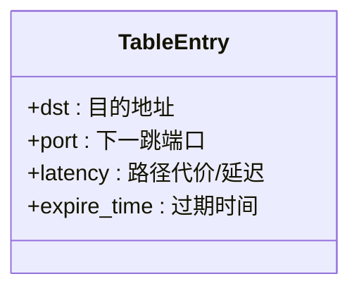

> [!NOTE] Title
> 好的协议不是防止所有错误，而是确保错误能被快速检测和修复

大概就是从头实现路由器算法的每个规则.

每个需要实现的函数, 都会以事件驱动的方式, 被框架的模拟器调用. 所以我们只需要实现具体函数即可, 调用过程不用管.
## stage1: 安装静态路由
先实现安装静态路由.
- 由"一个节点第一次连接到一个路由器" 事件触发
比较简单, 没有什么太多说的.
大概讲一下 TableEntry:

> [!NOTE] Title
> 这里的 latency 就相当于课本里所说的 cost

TableEntry 只告诉你我这个路由器能到哪里, 以及下一步你该去哪里.

## stage2: 转发数据包
- 用 packet 的 dst ,从*路由表*中找到*对应的路由表项*
- 检查路由表项是否为空 or 路由表项. latency >= INFINITY
	- 如果为 false: 说明这个 packet 可以转发 (有下一个目的地, 且下一个目的地可以到达 (latency < INFINITY))
## stage3: 转发路由表
- 对某一个路由器,定时转发其所有路由表项, 向其所有邻居

> [!NOTE] Title
> 要向该路由器所有邻居转发其所有路由表项
> 从路由表中查找到各个邻居需要走的端口, 从那些端口转发自己所有的路由表项.

## stage4: 更新路由表 
- 当路由器从邻居收到一条到某个目的地（route_dst）的路由通告时，决定是否更新自己的路由表。

### 主要流程

1. **计算总延迟**  
   `total_latency = route_latency + self.ports.get_latency(port)`  
   总延迟 = 邻居到目的地的延迟 + 本地到邻居的延迟

2. **设置过期时间**  
   `expire_time = api.current_time() + self.ROUTE_TTL`  
   路由项的有效期

3. **路由表更新规则**  
   - 如果路由表中没有该目的地（route_dst），直接添加新项。
   - 如果已有该目的地：
     - 如果原来的下一跳端口就是这次收到通告的端口，直接更新（刷新延迟和过期时间）。
     - 如果新通告的总延迟更小，则更新为更优的路径。
     - 否则，不做任何更改。

## stage5: 处理超时
- 定期检查路由表，把已经过期的路由项删除，保证路由表的有效性和准确性。
### 主要流程

1. **遍历路由表所有项**  
   `for _, table_entry in list(t.items()):`  
   遍历当前路由表中的每一项。

2. **判断是否过期**  
   `if table_entry.expire_time != FOREVER and table_entry.expire_time < api.current_time():`  
   - 如果该路由项的过期时间不是永久（FOREVER），并且已经小于当前时间（即已经过期），则进入下一步。

3. **日志记录**  
   `self.log(f"Route expired: dst={table_entry.dst}, port={table_entry.port}, latency={table_entry.latency}")`  
   - 记录一条日志，说明哪一项已经过期。

1. **删除过期项**  
   `t.pop(table_entry.dst)`  
   - 从路由表中删除这条过期的路由项。

基本的路由器功能已经实现, 下面是一些优化和问题修复

---

## stage6: 水平分割
- 水平分割: 在路由器互相发通告, 转发路由表的时候,不向学到该路由的端口通告该路由, 防止两个路由器无限循环互相转发数据 (也仅能防止两个路由器, 三个及以上做不到)

## stage7: Poison Reverse
- Poison Reverse: 如果我的到达某目的地的最短路径是通过你，那么我在通告你的时候，告诉你我到该目的地的距离是无穷大

## stage8: Counting to Infinity
以上两种方式都无法避免:
- 假设A、B、C形成环，A到C的链路断开：
	- A发现到C不可达，距离变大。
	- B还没意识到，告诉A“我到C距离是2”，A更新为3。
	- 下一轮，B又从A学到“3”，B更新为4……
- 核心思想：只要距离超过INFINITY，通告时就直接用INFINITY，防止路由器之间互相“抬高”距离，网络能快速收敛。
	- 把大于 INFINITY 的距离直接设为 INFINITY，核心目的就是为了防止路由器之间继续互相“抬高”数值

## stage9: Poisoning Expired Routes
- 当路由过期时，不是直接删除它，而是将其标记为无限大（毒化），并继续传播这个'死亡通知'一段时间
- 直接删除的核心问题：信息黑洞效应
	- 当路由器直接删除失效路由时，会立即形成信息真空：
		下游路由器不知情：相邻路由器仍需等待自己的超时计时器到期
		临时环路风险：其他节点可能继续向已删除路由的节点发送流量
		典型案例（7节点拓扑）：
		h1 -- s1 -- s2 -- s3 -- s4 -- s5 -- s6 -- s7
		当s1-s2断开：
		若s2直接删除h1路由：
	        s3仍认为可通过s2到达h1（跳数=3）
	        s3继续向s2转发数据包 → 黑洞丢包
> [!NOTE] title
> 删除是简单的，但正确的删除需要智慧

## stage10: 触发更新

### 1. 历史记录结构（self.history）

- 在`__init__`中添加了`self.history = {}`。
- 结构为： `{port: {dst: latency}}` (一个嵌套字典)
- 作用：记录“上次通过每个端口(port)通告给每个目的地(dst)的延迟(latency)”。

---

### 2. 辅助函数

#### should_advertise(self, port, dst, latency)
- 判断是否需要通告。
- 如果历史中没有该端口或目的地，说明是第一次通告，返回True。
- 如果历史中有，但延迟发生了变化，也返回True。
- 否则返回False（即内容没变，不需要通告）。

#### update_history(self, port, dst, latency)
- 每次通告后，更新历史记录。
- 保证下次判断时有最新的历史数据。

### 3. send_routes

- 遍历所有端口和路由表项。
- 对于每个端口-目的地组合，先判断是否需要通告（force为True时无条件通告）。
- 只有需要通告时才真正发送，并更新历史。
- 支持`single_port`参数，只向指定端口通告（用于链路刚上线时）。

### 4. handle_route_advertisement

- 收到邻居的路由通告时，只有当本地路由表真的被更新（新增、更优、同端口刷新）时，才调用`self.send_routes(force=False)`，即只在有变化时触发增量通告。

### 5. handle_link_up

- 当有新链路上线时，如果`SEND_ON_LINK_UP`为True，立即用`send_routes(force=True, single_port=port)`向新邻居通告所有路由。

### 6. handle_link_down

- 当链路断开时：
  - 如果`POISON_ON_LINK_DOWN`为True，把所有走该端口的路由毒化（latency=INFINITY），并用`send_routes(force=False)`增量通告毒化结果。
  - 否则，直接删除所有走该端口的路由。

### 7. 增量通告的核心

- 只通告“有变化”的路由（即历史记录和当前要通告的内容不同）。
- 这样可以减少冗余消息，提高网络效率。
