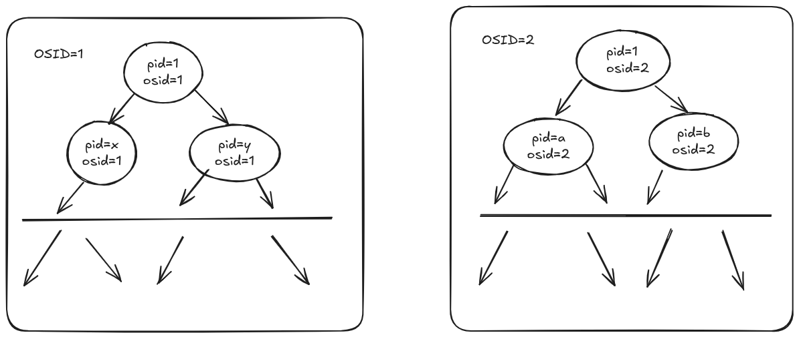
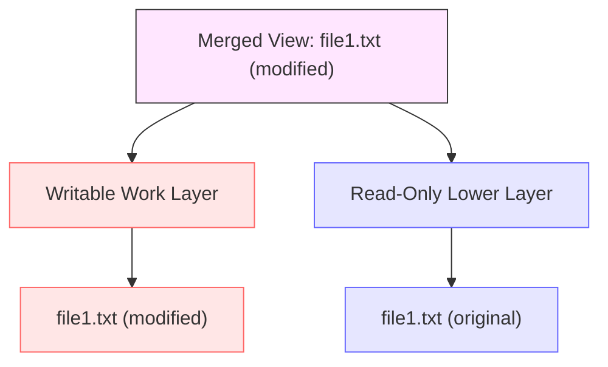

# docker底层原理简介

#conclusion

docker 为了实现容器间的隔离，资源的限制，高效性，分别使用了 linux namespace, Cgroups(control groups), Union FS 这几个技术，下面一一介绍

## Linux namespace

刚开始见到会联想到 cpp 的 namespace,了解之后发现二者在效果上差不多都是： 隔离某些东西（linux namespace：pid 对应的进程，一个pid在不同的namespace对应不同进程， cpp namespace： 一个函数名在不同namespace对应不同函数）

### 具体原理

- 以前：操作系统里 pid 和进程一一对应，不可能有进程的pid相同
- 现在：操作系统增加一个 *osid* ，现在一个进程的识别要同时匹配 *osid*， *pid*，一个进程树对应一个*osid*， 大概如下



> [!NOTE]
> 一个进程树对应一个*osid*
> 现在进程树隔离了,这样我们就可以创建两个不干扰的容器了

## Cgroups

前面可以让两个容器隔离了，现在还需要控制容器的 cpu 占用，内存占用等等，不能让容器随意使用系统资源。Cgroups 通过层级结构（hierarchy）和控制组（group）来管理资源。每个层级可以包含多个控制组，每个控制组可以包含多个进程。每个控制组可以独立地配置资源限制和优先级。

Cgroups的数据结构存储在 `/sys/fs/group` 下，大概有这些目录结构：

```
/sys/fs/cgroup/
├── cgroup.controllers
├── cgroup.max.depth
├── cgroup.max.descendants
├── cgroup.pressure
├── cgroup.procs
├── cgroup.stat
├── cgroup.subtree_control
├── cgroup.threads
├── cpu.pressure
├── cpuset.cpus.effective
├── cpuset.cpus.isolated
├── cpuset.mems.effective
├── cpu.stat
├── cpu.stat.local
├── dev-hugepages.mount
├── dev-mqueue.mount
├── dmem.capacity
├── dmem.current
├── init.scope
├── io.cost.model
├── io.cost.qos
├── io.pressure
├── io.prio.class
├── io.stat
├── irq.pressure
├── machine.slice
├── memory.numa_stat
├── memory.pressure
├── memory.reclaim
├── memory.stat
├── memory.zswap.writeback
├── misc.capacity
├── misc.current
├── misc.peak
├── proc-sys-fs-binfmt_misc.mount
├── sys-fs-fuse-connections.mount
├── sys-kernel-config.mount
├── sys-kernel-debug.mount
├── sys-kernel-tracing.mount
├── system.slice
└── user.slice
```

然后在 `/proc/*/cgroup` 下会有各个进程的所属的控制组信息，每一行表示一个进程在某个层级中的控制组路径。格式如下：
`<层级号>:<子系统>:<控制组路径>`
- 层级号：表示控制组所属的层级编号。
- 子系统：表示控制组管理的资源类型，例如 cpu、memory、blkio 等。
- 控制组路径：表示进程所属的控制组路径，从根控制组开始。

举个例子：

0::/user.slice/user-1000.slice/ user\@1000.service /app.slice/ app-Hyprland-dunst\@3883b287.service ：表示进程属于用户 1000 的 Hyprland-dunst 服务。路径中的每一级都表示一个控制组的层级结构。
- user.slice：表示用户级别的控制组。
- user-1000.slice：表示用户 1000 的控制组。
- user\@1000.service：表示用户 1000 的服务。
- app.slice：表示应用程序级别的控制组。
- app-Hyprland-dunst\@3883b287.service：表示 Hyprland-dunst 服务的具体实例。

还有：
0::/system.slice/systemd-userdbd.service
- system.slice：表示这是一个系统级别的控制组。
- systemd-userdbd.service：表示这是 systemd-userdbd 服务。

## Union FS

UnionFS是一种联合文件系统技术，它允许*多个文件系统挂载到同一目录下*，合并成一个整体视图。它采用*分层结构，底层为只读层，顶层为可写层，数据修改只发生在顶层*，利用“*写时复制*”机制确保底层数据不受影响。UnionFS在容器技术中广泛应用，如Docker使用类似的OverlayFS管理镜像分层。它优势在于高效存储、快速更新和简化管理，但也存在文件操作复杂性和潜在一致性问题。


