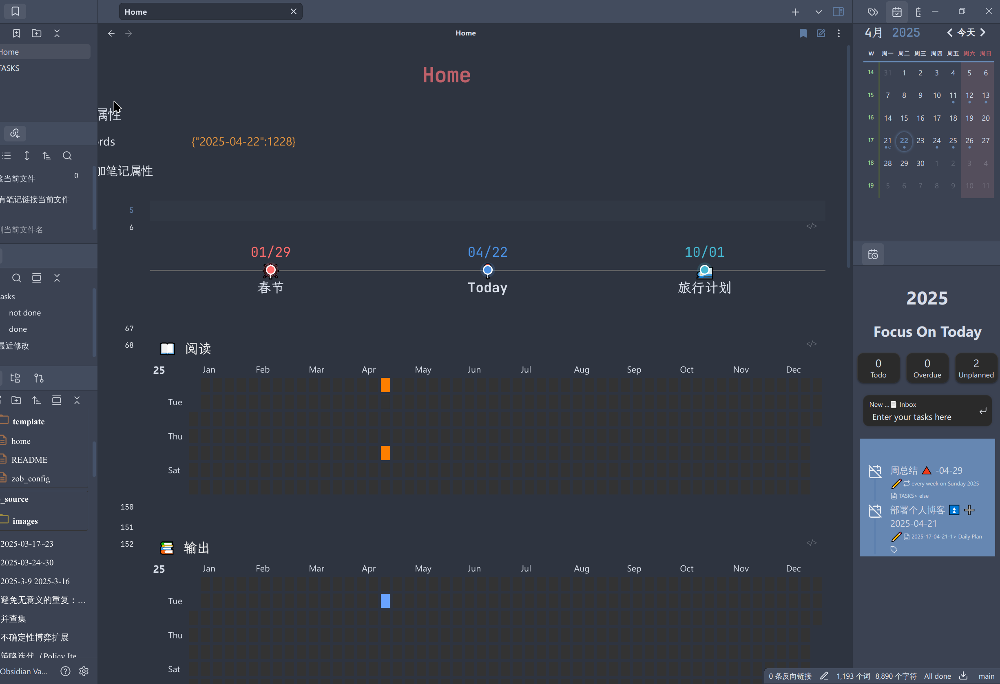

- 少折腾
- 记录下现在的成果
	- 主页
	- 时间线
		- 添加时间节点：在 Home 里把时间线的 events 加一项
	- 习惯记录
		- 更改标题：更改 `dv.span("** 📖 阅读 **") ` 括号中的内容
		- 更改习惯分类：更改 `const habitIntensity = getHabitInPage(page, 'reading')` 中‘reading’为对应的习惯分类，如 `outputing`
		- 更改颜色：更改 `color: "orange"` 中为 calendarData 中对应颜色
		- 记录每天的习惯：如`- [x] [obsidian折腾总结](./obsidian折腾总结/) #habit outputing:: 1 ✅ 2025-04-22`
			- 注意格式： 
				- `#habit` 必须在 `outputing` 等前面
				- `outputing` 后面要紧跟双冒号 `::`
				- 冒号后面接的是颜色深度，有范围限制
	- contribution  图 
	- tasks
		- tasks canlendar wraper

