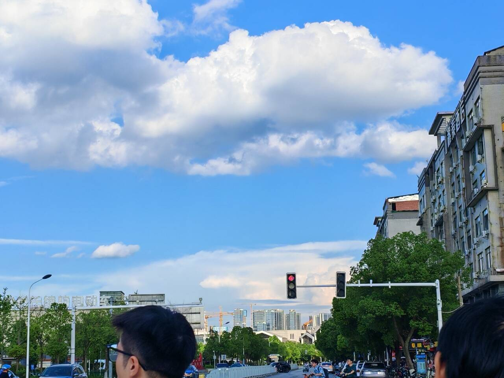

# 大一下学期总结
这学期的心态变了很多,我也不想在这篇文章里写太多技术相关的东西.主要就是记录下我目前的一些想法

## 学习
- 一开学想这学期好好学OS, 然后刚开学在看rcore,想这学期把rcore搞完,但是后面又没看了,感觉没啥意义. 后面看了几集jyyos,也没看了
- 后面就被忽悠去搞大创了,一个月边写申报书边看论文,了解了一点SLAM相关, 不过最后申报书没过,幸好我也不太想走这方面.
- 再后面看了点CS188, 了解了一点RL相关,后面有讲AI其他方面的概述,不知道暑假还继不继续看
- 这学期课内事情太多了,有点应付不过来
- 暑假打算看看计网,6.824 .

## 一些想法
我感觉我在人际交往还有个人还有别的方面有了很多变化

遇到了一些人,后面进了我们学校的"地下开源协会",全是大佬,有大二进wxg前端实习的,有同时是archlinuxcn,nix,deepin维护者的大佬.感觉稍微了解了一点开源这个世界

打了学校的排球阳光杯,虽然没上场.看大四老登在上面拼命打,拿下最后一球,赢了季军赛之后,坐在地板上哭,挺感慨的.想起了高三在我们的小高中的运动会,最后一跳三级跳拿下第一的事情(虽然厉害的人都去报跳远了).
时间总是这样流过.

这学期看了星际牛仔,漂流少年,冰海战记,怪奇物语.(阿谢拉特很帅)

某人能让我从别人的角度,另外的角度看自己看世界,我很感谢

爱到底是什么呢,该怎么去爱人呢,我很讨厌教育体系内缺少这方面的教育,明明是人生中重要的东西,但是大部分人却对此不甚了解,只能自己慢慢摸索.人生不应该只有面前的绩点,未来的保研,追求的工作,拿到的工资.人生中很多东西都很重要,所以请不要忘记自己心里重要的东西,自己身边重要的东西.

这学期接触了一些学校里的人之后,愈发感觉大学内部的信息流通实在是太闭塞,比如说我们学校里的开源协会,我原本以为学校里没有什么技术氛围,没想到还是有的(不过里面基本都是老登)

每个人都有一个不大不小的梦

这学期后面开始偶尔喝点酒,以前挺抗拒喝酒的,不过现在喝的也基本只是鸡尾酒.前段时间开源协会有人说要搞聚会,虽然最后也就几个人,吃晚饭去酒吧聊天.第一次去酒吧,感觉遇到的人经历的事听到的东西对我的世界观冲击有点大

人生还有很长啊.
