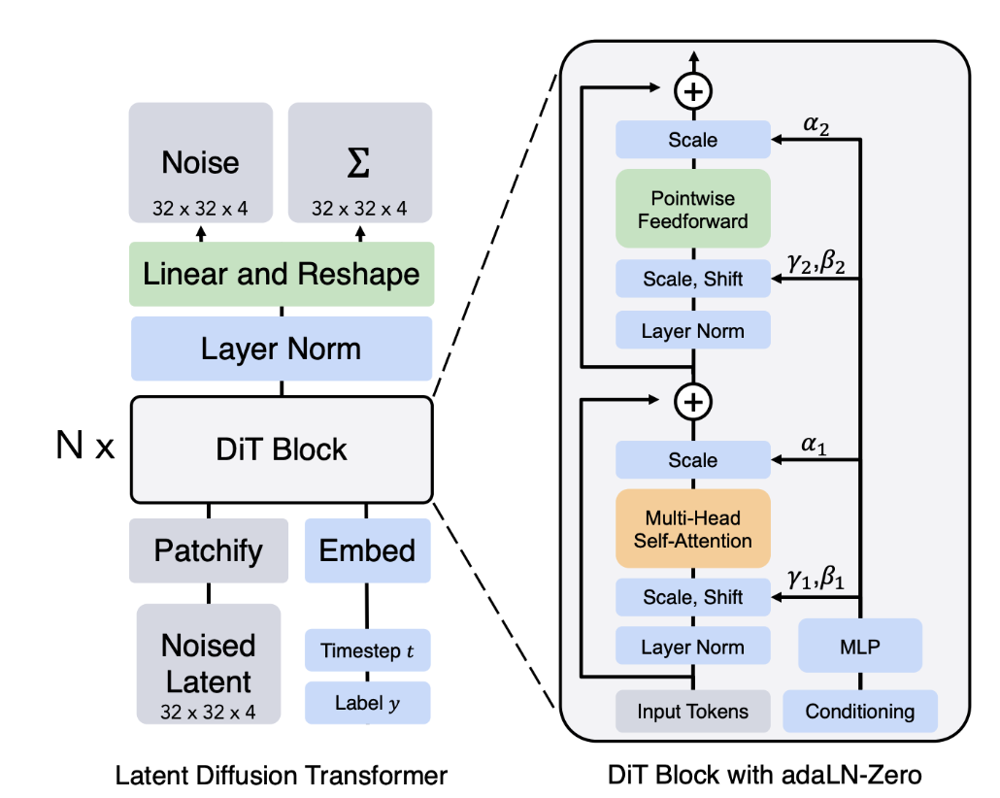

---
title: 如何构建图像生成器
date: 2026-03-12
timestamp: 2026-03-12T17:01:00+08:00
slug: 如何构建图像生成器
category: note
---

---
tags:
  - Area/AI/ML/Generative-Model
  - Course/MIT6S184
publish: "true"
---
前面我们学习了怎么训练一个 flow matching 或者 diffusion model 来从分布 $p_{data}(x)$ 中采样， 但是要构建图像生成器，我们需要一个技术: **条件生成/引导**， 即如何生成**符合特定条件**(如文本)的图像

## 1. 核心目标：从“随机生成”到“定向生成”

在之前的无条件训练中，模型学习的向量场或噪声预测网络是 $u_t^\theta(x)$。

引入条件 $c$（比如一段文本的 CLIP 嵌入向量、类别标签、或者另一张控制图像）后，我们的模型就变成了一个**条件网络** $u_t^\theta(x, c)$。

在训练阶段，这其实很简单：只需要在训练时把条件 $c$ 拼接到输入中，或者通过注意力机制喂给模型即可。但真正的魔法发生在**推理（采样）阶段**，我们需要一种机制来“放大”条件 $c$ 对生成结果的影响。

## 2. 核心技术：如何“引导”生成方向？

目前业界有两种主要的引导思路，其中第二种（CFG）是绝对的主流：

#### A. 分类器引导 (Classifier Guidance)

这是早期扩散模型使用的方法。它需要额外训练一个能在噪声图像上工作的分类器 $p(c|x_t)$。

在推理时，模型除了沿着无条件生成的方向走，还会计算分类器关于输入图像的梯度（即“这张图有多符合条件 $c$”），用这个梯度去强行拉扯每一步的生成轨迹，使其逼近目标条件。

- **缺点**：训练一个能在纯噪声和半噪声图像上准确工作的分类器非常困难，且非常耗时。
    

#### B. 无分类器引导 (Classifier-Free Guidance, CFG)

这是目前图像生成领域的**事实标准**。它的核心思想极其优雅：**不需要外部模型，
让生成器自己跟自己对比。**

具体的损失函数就是：
$$\mathcal{L}_{\text{CFM}}(\theta) = \mathbb{E}_{t, x_0, x_1, y, \mathbf{\epsilon}} \left[ \| \mathbf{u}_t^\theta(\mathbf{x}_t, \hat{y}) - (x_1 - x_0) \|^2 \right]$$

在训练时，我们以一定的概率（比如 **10%**）把条件 $c$ 置空（Drop out），这样同一个模型就*同时学会了“有条件生成” $u_t^\theta(x, c)$ 和“无条件生成” $u_t^\theta(x, \emptyset)$*

在推理采样时，我们同时让模型输出这两个预测，并沿着它们的**差值方向**进行外推：

$$\tilde{u}_t(x) = u_t^\theta(x, \emptyset) + w \cdot \big( u_t^\theta(x, c) - u_t^\theta(x, \emptyset) \big)$$

- $w$ 就是我们在用 AI 绘画时常调的 **CFG Scale（提示词相关性）**。
    
- **物理直觉**：$u_t^\theta(x, c) - u_t^\theta(x, \emptyset)$ 这个向量代表了“条件 $c$ 带来的特有方向”。把这个方向乘上一个大于 **1** 的权重 $w$，就能强迫模型生成更符合提示词、甚至具有高度特征化的图像。
> 其实我个人觉得网络的式子写成 $u_{\theta}(t, x_{t}, y)$ 更好理解一点， 因为 $t$ 也是网络的参数

## 3. 底层架构：文本条件是怎么“喂”进去的？

这里我们只介绍最基本的DiT架构，架构图如下

DiT的损失函数就是上面的
## 1. 宏观流程：Latent Diffusion Transformer (左图)

DiT 并不是直接在像素空间工作，而是在**潜空间 (Latent Space)** 工作。

- **Patchify（切片化）**：这是 Transformer 处理图像（**ViT**）的标配。它将输入的潜变量图像（图中是 $32 \times 32 \times 4$）**切割成一个个小的像素块（Patches）**，并将它们**拉平（Flatten）成一串序列**。就像把一幅拼图拆成一个个小方块，每个方块就是一个“Token”。
    
- **Embed（嵌入层）**：
    - **Timestep $t$**: 告诉模型现在处于去噪的哪个阶段（是刚开始的一团乱麻，还是快接近清晰图了）。
        
    - **Label $y$**: 这就是你提到的**条件生成**。比如“猫”的标签，会被转化为向量，引导模型生成特定内容。
        
- **DiT Blocks ($N \times$)**：这是模型的主体，由 $N$ 个重复的 Transformer 块堆叠而成。
    
- **Linear and Reshape**: 最后通过线性层把 Token 还原回图像的形状，输出预测的噪声或向量场。
    

---

## 2. 微观核心：DiT Block with adaLN-Zero (右图)

传统的 Transformer 块（如 GPT）通过 Self-Attention 学习序列关系，但 DiT 引入了 **adaLN-Zero (Adaptive Layer Norm)** 来注入条件信息。

### 如何注入条件：

图中右侧的 **Conditioning** 分支展示了条件信息是如何干预生成过程的：

1. **MLP 投影**：时间步 $t$ 和标签 $y$ 的向量合并后，通过一个 MLP（多层感知机）生成一系列参数（$\gamma, \beta, \alpha$）。
    
2. **Scale & Shift ($\gamma, \beta$)**：这就像是给 Layer Norm 加了一个“调节旋钮”。模型根据当前条件（比如“我要生成猫”），动态调整神经元的激活值，改变特征的分布。
    
3. **Self-Attention & Feedforward**：这是 Transformer 的标准配置，让不同的 Patch 之间进行信息交换（例如：左上角的猫耳 Patch 要和右下角的猫尾 Patch 保持一致性）。
    
4. **Scale ($\alpha$)**：这是 **adaLN-Zero** 的神来之笔。在残差连接（Residual Connection）之前，用一个系数 $\alpha$ 对当前块的输出进行缩放。在初始化时，$\alpha$ 会被设为 0，这能让模型在训练初期表现为一个恒等函数，极大提高了大型模型训练的稳定性。